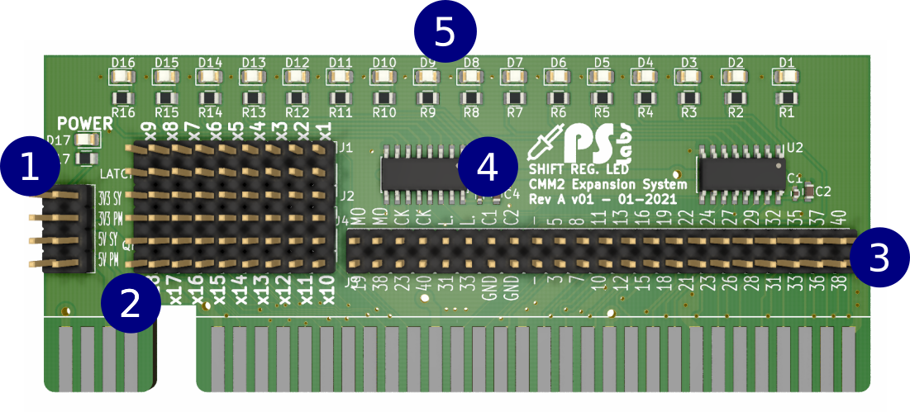
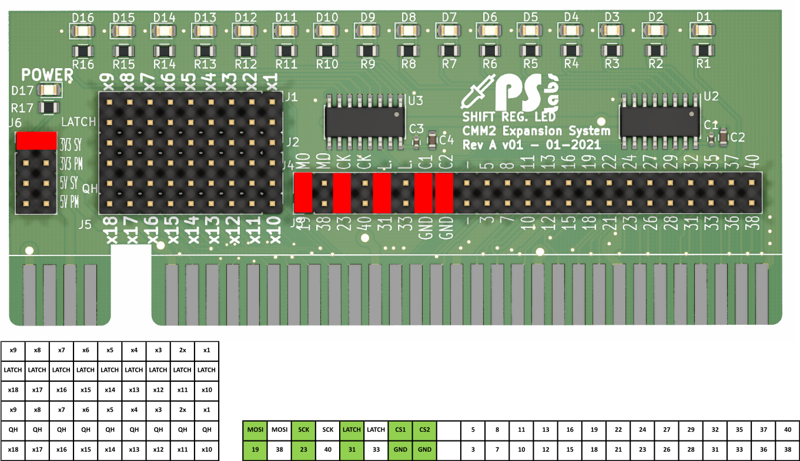
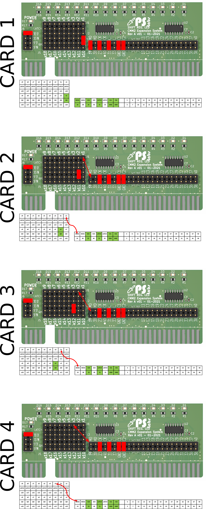

# CMM2-ExpansionCard-ShiftRegisterLed
Helps to learn how shift registers work, 16 led operated from 3 pins, can be daisy chained

Schematic can be found here: [schematic REV A v02](/Schematic/shift_led_REVA_v01.pdf)

Expansion system and cards can be purchased here: [PS Labs](https://sklep.pslabs.pl/Maximite-c91)



1. Power supply selector
2. Card configurator
3. Card configurator
4. Shift registers
5. 16 LED

# WARNING!

Expansion card used with this system have to have edges chamfered, using unchamfered card will result in slot damage.

# Assembly
1. Cut goldpin headers with pliers to correct length and install
2. Install jumpers
 
# Shift register single LED card sample code


For purpose of this code, card should be configured as follows:
1. J6 power selector jumper set to 3V3 SY
2. Connect MOSI to pin 19
3. Connect SCK to pin 23
4. Connect LATCH to pin 31
5. Connect CS1 (chip select 1) to GND
6. Connect CS2 (chip select 2) to GND
 
```basic
SETPIN 31, DOUT 'set pin 31 to latch the chip
SPI OPEN 195315, 0, 16 'mode 0, data size is 16 bits

junk = SPI(&B00) ' send the command and ignore the return
PIN(31) = 1
PIN(31) = 0

Do
cnt = 1
Do While cnt<65536
  junk = SPI(cnt) ' send the command and ignore the return
  PIN(31) = 1
  PIN(31) = 0
  cnt=cnt<<1
  'PRINT cnt
  PAUSE 100
Loop
Loop

SPI CLOSE 
```

# Shift register multiple LED card sample code
To connect multiple cards x1 to x18 lines can be used for cards to send overflowed QH signals.

**Multiple cards can draw more current than Maximite can supply, expansion Power Card should be used in that case.**

Set jumpers of all cards as shown on picture below if You use Power Card jumper J6 should be set to **3V3 PM**



Example cod can be found below, if different quantity than 4 cards used change value: *shiftno*

```basic
  SETPIN 31, DOUT 'set pin 31 to latch the chip
  SPI OPEN 195315, 0, 8 'mode 0, data size is 16 bits
  
  shiftno = 8 'number of shift registers(each card has 2 shift registers)
  
  DIM tosend(shiftno-1)
  DIM cnt = 1
  DIM cnt2 = 0
  
  
SUB ShiftSend c
  PIN(31) = 0
  For i=c-1 to 0 STEP -1
    junk = SPI(tosend(i)) ' send the command and ignore the return
    PRINT tosend(i)
  NEXT i
  PIN(31) = 1
END SUB
  
  
SUB ShiftArray c
  
  if tosend(cnt2)<128 THEN
    tosend(cnt2)=tosend(cnt2)<<1
  ELSE
    cnt=1
    tosend(cnt2)=0
    cnt2=cnt2+1
    IF cnt2 > shiftno-1 THEN cnt2 = 0
    tosend(cnt2)=1 'seed next value in array
  END IF
  
END SUB
  
tosend(cnt2)=1 'iniciate array with value to shift

  Do
    
    ShiftArray(cnt2)
    ShiftSend(shiftno)
    PAUSE 10
  
  Loop
  
  SPI CLOSE
```
